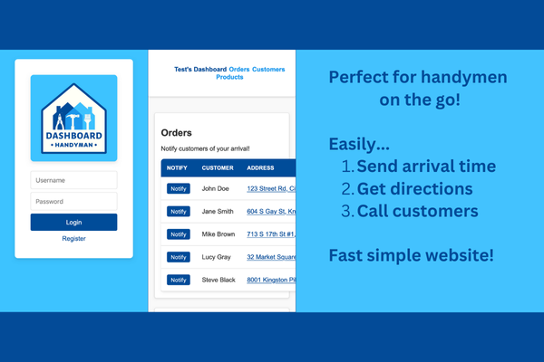

# Dashboard Handyman

Welcome to the handyman to your handymen :)

I made this in 1 week! This was made to show that I still have my LAMP skills that I gained while working as a WordPress developer 2017-2021. I initially gained Linux, Apache, MySQL, and PHP skills on the job, and didn't have a full stack app to show, until now! My favorite language is JavaScript, as you can probably tell by looking at my other repos. 

After working on this project, my love for full stack LAMP development got reignited!

### Features
- Notify customers when you're about to arrive, so they know you're coming
- Import/export products with CSV file format (more import/export abilities coming soon!)
- Customer directions and phone number calling are just a tap away
- See analytics of orders, products, and customers
- Create/Read/Update/Delete (CRUD) customers and products in neat interface

## Screenshots

